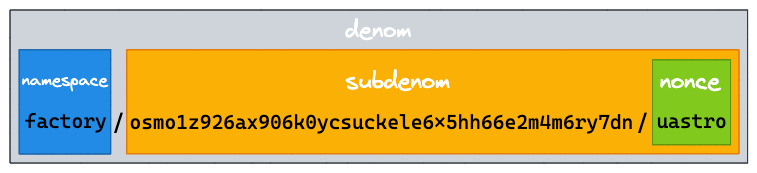

# cw-token-factory

Inspired by Osmosis' [x/tokenfactory](https://github.com/osmosis-labs/osmosis/tree/main/x/tokenfactory) module, the `token-factory` contract is an implementation of the [`bank`](../bank) contract's namespace admin. It allows anyone to permissionlessly create denoms, at a fee (set by governance).

On chains with permissioned contract deployment, we expect it to be more typical for projects to reserve their own namespaces at the bank contract (at approval by governance). The `token-factory` contract is perhaps more suitable for permissionless chains.

## Terminology

Tokens created with the `token-factory` contract comes with denoms of the following format:

```plain
factory/{creator}/{nonce}
```

Where `creator` is the token creator's address, and `nonce` is an arbitrary alphanumeric string specified by the creator. See the image below for an example:



## License

Contents of this crate are open source under [GNU Affero General Public License](../../LICENSE) v3 or later.
